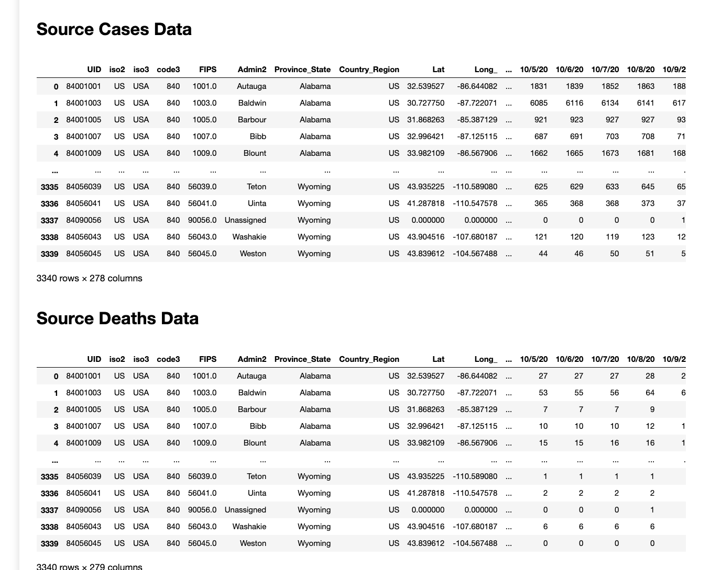
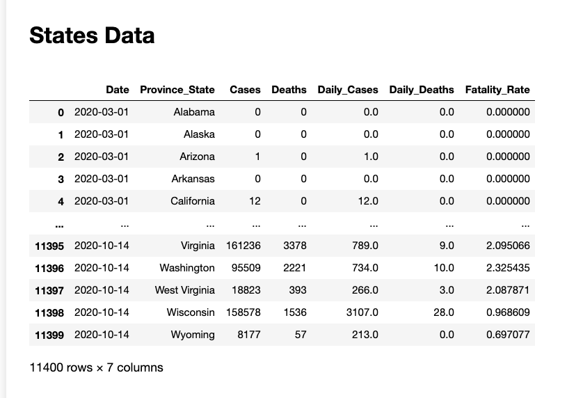
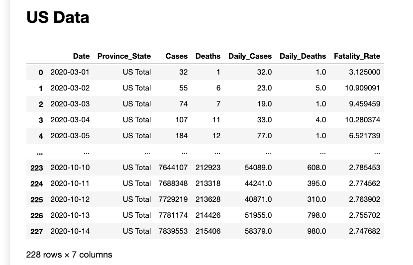

## Covid-19
Data visualization project of Covid-19 virus for the continental US.
Source: [Center for Systems Science and Engineering (CSSE) at Johns Hopkins University](https://github.com/CSSEGISandData/COVID-19/tree/master/csse_covid_19_data/csse_covid_19_time_series)

View this project [HERE](https://toanvang.github.io/covid19/)
## Technologies and Implementations
The project is created with:
* Python
* NumPy
* Pandas
* Matplotlib
* Seaborn
* Plotly

The code is written dynamically to give you the most up to date visualization when it is compiled.  

The provided data only has cases and deaths number for the counties. This raw dataset is transformed to represent the states and the US with added daily cases, daily death, and fatality rate columns. Cruise ships, and region that is not in the continental US are not considered for the data.

## Data Processing (Pandas DataFrame)
* Merge raw cases and deaths data into one dataframe
* Remove unnecessary information such as uid, lat, long, cruise ships and non-continental US region 
* Transform from wide to long dataframe by pivoting the date columns to rows
* Perform calculation to transform the dataset from counties to states and the US
* Perform calculation to add daily cases and daily deaths data
* Replace missing value NaN with 0
* Create a second dataframe that includes data for the US overall

## Graphs and Plots
* US total cases and deaths
* US fatality rate
* US total daily cases
* US choropleth map
* US daily Cases heatmap
* Total cases of states
* Daily cases of states
* Top 5 with the most cases
* Top 5 fatality rate vs US fatality rate
* Top 5 daily cases & US average daily cases
* Timeline comparison of top 5 states

# Raw Data

# After Data Processing
## States Data

## US Data

